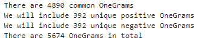

> Repository: [https://github.com/stephanedorotich/550](https://github.com/stephanedorotich/550).
>
> I attest that all work is my own and that I worked on this project by myself. Stéphane Dorotich, UCID: 10154487

# Abstract

231,000 Amazon Reviews from the Musical Instruments category were used to develop a Sentiment Analysis Regularized Logistic Regression ML model. A Bag of Words approach was used. Review Text was transformed into NGrams which were used to derive a feature vector for each review. Two models were developed, one that uses a Bag of OneGrams, and a second that uses a Bag of TwoGrams. It was found that the second model had both improved Precision and Recall when compared to the first, which supports the idea that using features that have more context is helpful in improving the precision of ML models developed for text based analysis.

:::columns

# Introduction

Language is fluid, nuanced, and diverse. Our voices are like fingerprints. We express ourselves according to our interests, knowledge, education, culture, and environment. When we speak, we reflect our experience.

Although tempting, it is incorrect to presume that language emerges from a finite set of words. A model of language cannot be developed from a dictionary. Semantics, the study of linguistic meaning, is an entire field of research. This complexity makes language an algorithmic behemoth from a computational perspective. Yet understanding it's fabric is a worthy endeavor given that language is the backbone of communication. So we try. We try to model the brilliance of language with primitive tools such as Linear Regression and Neural Networks; attempting to chisel the masterpiece from corpora of text. Perhaps we can achieve some resemblance to the magnificence of reality. This difficultly is easy to understand when considering accented speech. As Shen et al. puts it "Accent modeling of non-native speech is definitely challenging, because the acoustic properties in highly-accented speech pronounced by non-native
speakers are quite divergent" [@hs2015].

It feels like carving a masterpiece with wooden tools. It is the case that there are sophisticated Natural Language Processing (NLP) models. However, at present, I neither have the knowledge nor the skills to create a sophisticated model. What I can do is to learn how to hold the tools at my disposal.

## Problem

Sentiment analysis is a good place to begin language comprehension. It is the relatively straightforward problem of binary classification. I will develop three ML Models for sentiment analysis of Amazon Reviews to investigate where models that include contextual features are more precise than models that don't include contextual information.

## Background and Related Work

Sentiment Analysis has been a burgeoning field of research for nearly 20 years. More than 99% of papers on the topic have been published since 2004 [@mm2017]. Since large corpora of text became widely available on the internet it has become an exciting area of research and a desireable commercial enterprise.

There are three established approaches to Sentiment Analysis [@mw2022]; a Lexicon Based Approach, a Machine Learning Approach, and a Hybrid Approach.

The Lexicon based approach begins with a dictionary. This dictionary assigns a score to each token (word) that is positive or negative depending on how it correlates to the sentiment of the document. Typically, this value is in the range [-1, 1] with the extreme ends indicating extreme negative or extreme positive correlation. Documents are parsed word by word and assigned a score based on the sum of the scores of its words as specified in the Lexicon. A negative score indicates negative sentiment while a positive score indicates a positive sentiment. This approach is effective, but it is difficult to scale. Specifically because developing the Lexicon requires domain specific knowledge and must change as the domain changes. As Wankhade et al. [@mw2022] explain - "given the word 'small' and the sentences 'The TV screen is too small' and 'This camera is extremely small', the word 'small' in the first sentence is negative, as people generally prefer large screens, whereas in the second sentence it is positive, as if the camera is small, it will be easy to carry". The Lexicon Based approach is not generalizeable. In order to use the model in a new domain, the lexicon must be redeveloped.

As I do not have the capacity to develop a Lexicon, I choose to focus on the Machine Learning apparoach. Specifically, a binary classifier that is a Regularized Logistic Regression model. I will describe this approach in more detail later.

Although the hybrid approach is intriguing, it is beyond the scope of this project.

## Applications

In the context of Amazon reviews, determining whether a review is positive or negative is neither interesting nor useful. The rating attached to each Amazon review makes the sentiment of the review self-evident. That said, developing a generalized sentiment classifier can be useful if it can be deployed in new contexts. For instance, a general sentiment analysis method could be used on Tweets or on YouTube comments to determine how a population feels about a particular news event, company, or idea.

Additionally, determining the usefulness of context-based in improving model precision is  is helpful to a 

## Goals

Foremost, my goal is to explore NLP as I have been curious about it for a long time and have not had the opportunity to explore it yet. I have taken several Linguistics courses, which is part of what sparked my interest.

Beyond that, my goal is to demonstrate that using TwoGrams as features in a Regularized Logistic Regression produces a more precise model compared to a model that uses only OneGrams. My hypothesis is that because TwoGrams carry additional contextual information that it will help distinguish between reviews that have similar words.

For example, the 3-gram "not very good" carries a negative sentiment. Considered as OneGrams it is ["not", "very", "good"] which is difficult to distinguish from the positive review "Not a day goes by that I don't use it. Very good!" because they contain the same OneGrams.

## Data Analysis Question

Is a Regularized Logistic Regression model built with both OneGram and TwoGram features more **precise** than a Regularized Logistic Regression model that uses only OneGram features?

How do their **accuracy** and **recall** compare?

# Terminology

Sentiment Analysis:

> The practice of determining whether a document contains positive or negative sentiment.

NGram (OneGram, TwoGram, etc.):

> All combinations of N adjacent words taken from a sentence.

Stopwords:

> Stopwords are words to be removed from text prior to analysis because they carry little to no meaning. Some examples are ["the", "this", "he", "her", "is", "are"]

Bag-of-Words:

> A Bag-of-Words is a set of words used as features for a ML model. A document can be compared against this set to determine a feature vector.

Bag-of-NGrams:

> Identical to a Bag-of-Words except that it is a set of NGrams instead of words. When I refer to a "bag" I am refering to a Bag-of-NGrams.

# Methodology

## Method

To investigate my hypothesis, I decided to build 2 models using Regularized Logistic Regression.

Model A: Composed of 5674 OneGram features
Model B: Composed of 26854 TwoGrams features

My goal is to compare the precision of each mode

## Data Source

Data retrieved from:

Jianmo Ni, Jiacheng Li, and Julian McAuley. 2018. Amazon Review Data \[json\]. Retrieved from [https://nijianmo.github.io/amazon/index.html](https://nijianmo.github.io/amazon/index.html)

We downloaded 231,000 reviews from the Musical Instruments category for this project.

## Data Cleaning

A few naming collisions in the Json Data needed to be resolved before it could be loaded into a Spark Context. These two naming collisions are described in [data_pipeline.ipynb](data_pipeline.ipynb) and were resolved with a few bash commands.

The data itself was cleaned by:

- Dropping all columns except 'overall' and 'reviewText' (where 'overall is a rating from 1-5)
- Converting 'reviewText' to lowercase
- Removing all non-alphabetic characters from 'reviewText'
- Converting 'reviewText' into an array of words
- Converting 'overall' to a 1 or 0. $\{1,2,3\} \rightarrow 0$ and $\{4,5\} \rightarrow 1$.
- Removed all rows with empty text

Here is the distribution of ratings prior to converting them to a binary value of Positive/Negative. As you can see, there are substantially more positive sentiment ratings than negative ones.

## Bag of NGrams

Developing the bags turned out to be the most difficult part of this project. Several challenges arose:

1. How do I use Spark to get NGrams?
2. How do I create a bag of both OneGrams and TwoGrams?
3. What selection criteria do I use for NGrams to include in the bags?
4. How big should the bags be?

The first two questions were simply technical challenges that I resolved. The last questions were both pertinent to the project and my investigative process.

For question 3, the inclusion criteria, I used the following rule:
- Include the greatest frequency NGrams

Including high frequency NGrams helps reduce the sparsity of the feature vector and ensure that the NGrams occur many times which helps in Logistic Regression.

For question 4, I had some investigating to do. In a blog post on the KNIME Analytics Platform website [@kt2016] it was suggested that only NGrams that appear in 1-2% of documents should be included in the bag of words. I tried this to start, but discovered that it resulted in too few feature's being chosen and consequently a lot of reviews had 0 features. Instead, I decided to build the bags using 10% of the available NGrams. I chose this number because, for the OneGrams, this results in 99.53% of the original data having at least one feature. This coverage of the TwoGrams using the same top 10% selection criteria results in far fewer rows having at least one feature.

In addition to selecting the top 10% of OneGrams for Model A, and the top 10% of TwoGrams for Model B, I wanted to ensure that there was a reasonable representation of features for both Negative as well as Positive reviews.

To do this, I took:
- The 5674 most frequent OneGrams appearing in Positive Reviews
- The 5674 most frequent OneGrams appearing in Negative Reviews

Of those two sets, the 4890 OneGrams that were common between them were included in the final Bag of OneGrams while the remaining "space" in the bag was populated with 392 of the remaining most frequent OneGrams for the Positive and Negative reviews.

In both cases, I removed all NGrams that included an stopword from the NGram lists before creating the Bag of Words. Removing stopwords is common practice in [@bh2017] text based machine learning. It removes high-frequency words that carry little semantic meaning and so removes low meaning words from being included in a Bag of Words. I used a set found [here](http://snowball.tartarus.org/algorithms/english/stop.txt), I edited it so that negations were not removed.

Here are the 6 most frequent OneGrams. Observe that of the 6 most frequent words, that 5 of them exist in both the Negative review set as well as the Positive review set. Indicating that it may be difficult for these words to strongly correlate with positive or negative sentiment. Recall that this data is from a Musical Instruments review set, and so words like "guitar" and "sound" are unsurprising.

Here are the 6 most frequent TwoGrams. Notice that the TwoGrams appear to be more informative as they carry contextual information.

## Generating Data for ML

With three Bags of Words created, I was ready to generate data to feed to a Regularized Logistic Regression model. In Spark, this model works well with SparseVector data which can be loaded from a `libsvm` format. I needed to transform my `basic_rdd` that contained each review with it's list of words, into a `RDD\<LabeledPoint\> that consisted of \<Label, SparseVector\>. The Sparse Vector was built by adding the index of any NGram contained in the review. Each feature is either a 0 or a 1 where a 1 indicates that the NGram is found in the review text. Here's a screenshot of what some of that data looks like:

## Machine Learning Model

Training and Testing data sets were created using a random sampling of the Model A and Model B data. A 60-40 train/test split was used. Regularized Logistic Regression models were trained on with the training.

### Model A HyperParameters

- Max Iter: 10
- RegParam: 0.1
- Threshold: 0.708

### Model B HyperParameters

- Max Iter: 10
- RegParam: 0.2
- Threshold: 0.756

The Regularization Parameter was set by testing values to minimize the difference between Training Accuracy and Testing Accuracy, in order to strike a balance between Overfitting to the training data and being able to generalize to the test data. I found that increasing the RegParam beyond the values above resulted in no increase to generalization, but negatively impacted it's accuracy on the training data.

The Threshold was set by optimizing the F-Score - which serves to find a happy medium between Precision and Recall of the model.

The ROC curve is shown here:

## Performance Metrics

Area under ROC: This metric indicates the precision and recall of a model, values closer to 1 are prefered.

Model accuracy: This metric indicates how well the models are able to predict the sentiment of the input and training data.

Precision Recall Curve: This curve shows the Precision and Recall of a model as the threshold changes. More area under the curve is better.

# Results

Our performance metrics indicate that the TwoGram model (Model B) outperforms the OneGram model (Model A) in Precision and Recall. This supports my hypothesis that having more contextual features might increase the precision of a ML model.

That said, it does not appear that this greater precision translated into better performance on the test data, in fact, we see that the OneGram model has marginally better performance on the test data (0.897 for Model A, 0.888 for Model B).

Overall, the increased precision on the training data is perhaps explained by the significantly larger feature list (26854) of the TwoGrams whose frequencies are small compared to those of the OneGrams. Because these features are more specific is may result in these less frequent TwoGrams overfitting to the training data. Whereas the OneGram model, which only has 5674 features, is "forced" to be more general. This may be similar to the limitations of the Lexicon Based approach described by Wankhade et al. [@mw2022] where the lexicons are too domain specific which limits their ability to generalize well.

Interestingly, by examining the size of each of my data files, it becomes clear that the Model B has significantly sparser feature vectors. In spite of having 5x the number of features, the size of the data is almost 4x smaller than the data for Model A.

I also found it concerning that 15.46% of the input data was dropped for Model B because these rows had no features. That shows that the selection criteria for TwoGrams was not sufficiently broad. Had I made it broader, however, it would likely exacerbate the overfitting problem I noticed.

Overall, neither of these models is particularly accurate. ~85% of the data is Positive Sentiment which means that blindly guessing "positive" would result in 85% accuracy. These models only exceeded that by ~6-8%. Perhaps, using a greater variety of data (there are millions of rows of data from the Amazon Review source linked earlier) could result in a more generalizeable or accurate model.

An improvement and area for future work would be to create a hybrid bag of NGrams that uses both OneGrams and TwoGrams. The selection criteria would need to be reconsidered to prevent too much overlap. I had pursued this originally, but discovered that my selection criteria resulted in almost perfect overlap between the TwoGrams and OneGrams and so the addition of TwoGrams to the model had no impact on accuracy.

Overall, I learned a lot about Spark, manipulating RDD's, and creating Bags of Words as a step in text based analysis.

:::

# Reference